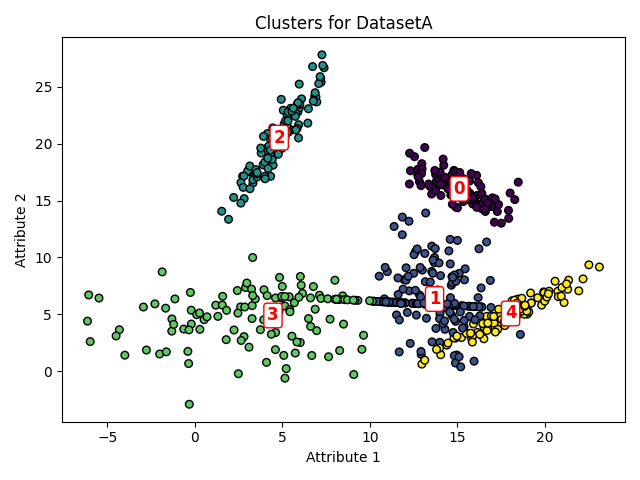
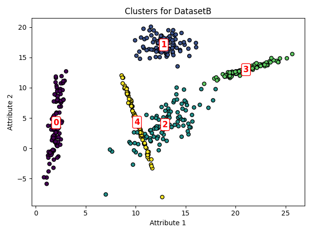

## Supervised and Unsupervised Learning

### Part 1 - Supervised Learning
We predict a target variable `z` from two inputs `x` and `y`. Given the 50 noisy samples and the nonlinear relationship, we chose a **polynomial regression** model with **Ridge regularization**:
- **Model Architecture**:  
  - **Feature Expansion**: Polynomial features of degree 2 (including cross-terms) are generated from `x` and `y`.
  - **Ridge Regression**: Regularizes the model to prevent overfitting.
- **Hyperparameter Tuning**:  
  - We use 5-fold cross-validation to select the optimal regularization strength (`alpha`).
- **Justification**:  
  - A low-degree polynomial (degree 2) is sufficient to capture the nonlinearity while avoiding the risk of overfitting the small dataset.
  - Ridge regression penalizes overly complex models, thus trading off between model complexity and empirical loss.

### Part 2 - Unsupervised Learning
We perform clustering on two datasets (`hw2-Part2-datasetA.csv` and `hw2-Part2-datasetB.csv`), each containing two attributes.
- **Method**:  
  - **Gaussian Mixture Model (GMM)** is used to model the data as a mixture of Gaussian distributions.
- **Model Selection**:  
  - The optimal number of clusters is determined using the Bayesian Information Criterion (BIC), which helps balance model fit with complexity.
- **Output**:  
  - For each dataset, the script prints the optimal number of clusters along with the means and covariance matrices for each cluster.
```bash
Optimal number of clusters for DatasetA: 5

Cluster 0:
Mean: [15.10830424 16.03040378]
Covariance:
 [[ 2.20698363 -1.37320446]
 [-1.37320446  1.71090356]]

Cluster 1:
Mean: [13.70050405  6.34316735]
Covariance:
 [[ 3.09863288 -0.86236274]
 [-0.86236274  5.9360606 ]]

Cluster 2:
Mean: [ 4.82022378 20.52371459]
Covariance:
 [[1.81448251 3.8707702 ]
 [3.8707702  9.38407828]]

Cluster 3:
Mean: [4.46252364 4.89288271]
Covariance:
 [[21.82592886  2.34969475]
 [ 2.34969475  5.09735446]]

Cluster 4:
Mean: [18.04659419  5.06974814]
Covariance:
 [[4.30755122 3.207601  ]
 [3.207601   2.68333832]]
BIC plot saved as DatasetA_BIC.png
Cluster plot saved as DatasetA_clusters.png

Optimal number of clusters for DatasetB: 5

Cluster 0:
Mean: [2.04170121 4.2318357 ]
Covariance:
 [[ 0.18953851  1.32952969]
 [ 1.32952969 19.68033259]]

Cluster 1:
Mean: [12.81778325 17.07544081]
Covariance:
 [[ 1.54803176 -0.03799372]
 [-0.03799372  1.61215023]]

Cluster 2:
Mean: [12.95148651  3.92065428]
Covariance:
 [[4.48061054 4.63203399]
 [4.63203399 8.60469064]]

Cluster 3:
Mean: [21.04994358 12.99126694]
Covariance:
 [[2.82393693 1.42687763]
 [1.42687763 0.78250636]]

Cluster 4:
Mean: [10.14170718  4.31538903]
Covariance:
 [[ 0.6181951  -3.00826214]
 [-3.00826214 14.74944892]]
BIC plot saved as DatasetB_BIC.png
Cluster plot saved as DatasetB_clusters.png
```
- **Cluster Comparison**:
   
  
  

-From the images, it is apparent the most similar clusters are clusters 0 from dataset A and 1 from datasetB, and clusters 1 from dataset A and 2 from datasetB.

## Running Instructions (Windows)

### Part 1 - Supervised Learning
1. Open a Python virtual environment:
   ```bash
   python -m venv supervised_project
   supervised_project\Scripts\activate
2. Install the requirements:
   ```bash
   pip install -r requirements.txt
3. Run the script:
   ```bash
   python supervised.py

### Part 2 - Unsupervised Learning
1. Open a Python virtual environment:
   ```bash
   python -m venv unsupervised_project
   unsupervised_project\Scripts\activate
2. Install the requirements:
   ```bash
   pip install -r requirements.txt
3. Run the script:
   ```bash
   python unsupervised.py
